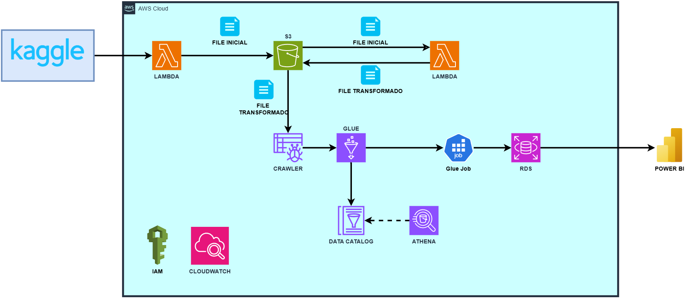

# 🚀 ETL Detección de Transacciones Bancarias Fraudulentas (Kaggle - AWS -Power BI) 📊

- Power BI: [ETL de Transacciones Bancarias Fraudulentas](./docs/Bucket_S3.md)

  

## Resumen 📋

📌 Análisis de Fraude en Tarjetas de Crédito: Datos, Detección y Decisiones

Cada año, el fraude con tarjetas de crédito le cuesta miles de millones al sistema financiero. Los bancos y empresas buscan frenar estas pérdidas, pero hay un reto enorme: ¿cómo detectar el fraude sin afectar la experiencia de los clientes?

Los falsos positivos—cuando una transacción legítima es bloqueada por error—pueden frustrar a los usuarios y generar desconfianza en el sistema. Por eso, contar con métodos precisos y eficientes es clave para encontrar el equilibrio entre seguridad y usabilidad.

🎯 ¿Qué haremos en este proyecto?

Vamos a analizar un dataset de Kaggle con información enfocada en las transacciones con tarjetas de crédito. El objetivo es identificar patrones de fraude y evaluar su impacto financiero, utilizando dos enfoques clave:

#### 🚀 1. Procesamiento con AWS (Lambda + S3)
- Limpieza y estructuración del dataset para contar con información precisa.
- Automatización del flujo de datos con los servicios de AWS

#### 📊 2. Visualización en Power BI
- Creación de dashboards interactivos para explorar tendencias de fraude.
- Análisis del comportamiento de los usuarios y detección de patrones sospechosos.

🔍 ¿Por qué es importante este análisis?

Este estudio nos ayudará a entender mejor cómo optimizar la detección de fraudes, reducir falsos positivos y mejorar la seguridad, sin afectar la experiencia del usuario.

💡 Al final, el objetivo es simple: hacer que los sistemas financieros sean más seguros sin hacerles la vida imposible a los clientes.

## Arquitectura 💡

La solución desarrollada esta implementada en AWS y Power BI.

  

## Tecnologías Implementadas 💻

- AWS
- Docker
- Python(version 3.13)
- Power BI

## Servicios utilizados en AWS ⛓️‍💥

- S3
- Lambda
- Glue
- RDS
- IAM

## Configuraciones de los servicios en AWS ⚙️

- [Creación Bucket S3 README](./docs/Bucket_S3.md)
- [Lambda_Kaggle_Extraccion  README](./docs/Lambda_Kaggle_Extraccion.md)
- [Lambda_Save_File_S3 README](./docs/Lambda_Save_File_S3.md)
- [Crawler_S3_to_Glue-DataCatalog README](./docs/Crawler_S3_to_Glue-DataCatalog.md)
- [Creación RDS_MySQL README](./docs/RDS_MySQL.md)
- [Job DataCatalog_to_RDS README](./docs/DataCatalog_to_RDS.md)

## Consideraciones futuras 🔧

- Actualmente el flujo de trabajo se ejecuta a demanda del usuario, de acuerdo a como este le considere necesario, ya que los diversos servicios actualmente hacen parte de la capa gratuita que ofrece AWS y la ejecución frecuente de estos, debe ser puesta a revisión para determinar los posibles costos que se generen y no sean tenidos en cuenta en la capa gratuita.
- Para contar con un proceso completamente automatizado, en el futuro se prevee utilizar servicios de AWS como Amazon EventBridge, Step Function, Trigger, etc. Los cuales permitan la ejecución de algunos servicios cada cierto tiempo y sirven como disparadores para iniciar otros servicios, por ejemplo un Trigger entre el "Crawler" y el "Job" de Glue o la ejecución periodica de Lambda para consultar el dataset en Kaggle.

## Licencia ☑️

Copyright 2025 Keiver Reinaldo Rincon Pabon

